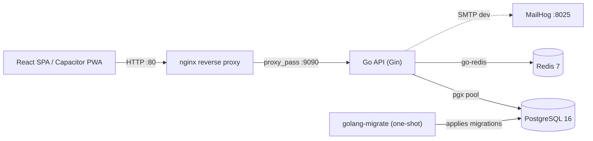
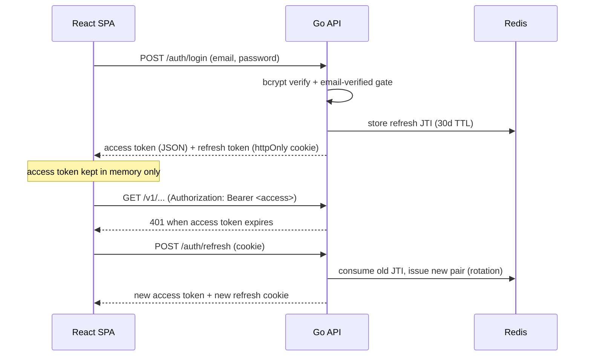

# Voltana V2 — Architecture

A system overview: the runtime topology, the backend's layered design, the folder structure, the full API
surface, the data model, and the authentication / authorization flows.

---

## 1. System Topology

All client traffic enters through **nginx**, which reverse-proxies to the **Go API**. The API is the only
component that talks to **PostgreSQL** (source of truth) and **Redis** (ephemeral state). In development,
**MailHog** captures outgoing verification email.



- **nginx** re-resolves the `api` container via Docker DNS per request (`resolver 127.0.0.11`), so recreating
  the API container is picked up without an nginx reload. It sets `X-Real-IP` from `$remote_addr` (used for
  rate-limit keys; clients cannot forge it).
- **Compose startup order** (health-gated): `postgres → redis → migrate (exits 0) → api → nginx` (+ `mailhog`).
- The frontend is built with Vite; `VITE_API_URL=/` keeps it **same-origin** with the API behind nginx — required
  for the in-memory access token + httpOnly refresh-cookie scheme.

---

## 2. Backend — Layered Design

The Go API follows a strict one-direction dependency flow. **Business logic never lives in handlers; DB access
never happens outside repositories.**

```
HTTP request
   │
   ▼
handler/      → request binding, status codes, error→HTTP mapping (no business logic)
   │
   ▼
service/      → business rules, validation, error translation, caching (no SQL)
   │
   ▼
repository/   → all SQL via pgx; user/ownership scoping enforced here
   │
   ▼
domain/       → plain structs (entities, inputs); no framework imports
```

Cross-cutting:

- **middleware/** — `Auth` (validates the Bearer access token, sets `user_id` on the context) and `AdminOnly`
  (fresh DB admin check; gates station writes).
- **mailer/** — SMTP + dev-log implementations behind a `service.Mailer` interface.

### Key principles

- **User isolation in the repository layer.** User-owned tables (cars, charging sessions, settings) are always
  queried `WHERE user_id = $1`; a cross-user id returns *not found* (404), never another user's row. There is no
  Postgres RLS (that was the Supabase MVP) — isolation is explicit in SQL.
- **Shared reference data is not user-scoped.** `ev_models` and `charging_stations` are readable by any
  authenticated user; only `charging_stations` is writable (admins only).
- **Errors translate at each boundary.** Repository sentinels (e.g. `ErrNotFound`) → service sentinels
  (e.g. `ErrStationNotFound`) → HTTP envelope `{ "error": "...", "code": "..." }`.

---

## 3. Folder Structure

```
voltana-api/
├── cmd/server/main.go          # composition root: wiring + routes
├── internal/
│   ├── handler/                # HTTP layer (auth, car, charging, settings, analytics, station, health)
│   ├── service/                # business logic (+ *_test.go unit tests)
│   ├── repository/             # pgx data access (+ Redis token store)
│   ├── middleware/             # Auth, AdminOnly
│   ├── domain/                 # entities & inputs
│   └── mailer/                 # SMTP / dev-log mailer
├── Dockerfile                  # multi-stage build (in-container Go compile)
└── Dockerfile.runtime          # runtime-only image from a host-compiled binary (loaded-host fallback)

voltana-web/
├── src/
│   ├── features/<name>/        # api.ts (HTTP) + hooks.ts (TanStack Query) + components
│   │   ├── auth/  cars/  charging/  ev-models/  settings/  analytics/  stations/
│   ├── pages/                  # route screens (Index, Charging, Map, …)
│   ├── components/             # shared UI (shadcn/ui)
│   └── lib/                    # api client (JWT + silent refresh), auth-store, cost helpers
└── vite.config.ts

migrations/                     # golang-migrate (paired .up.sql / .down.sql)
nginx/nginx.conf                # API reverse proxy
docker-compose.yml
```

### Frontend conventions (ADR-002)

- **No component calls `fetch()` directly.** All HTTP goes through `features/<name>/api.ts`, exposed via
  `features/<name>/hooks.ts` (TanStack Query). The single shared `lib/api.ts` client attaches the Bearer token,
  sends the refresh cookie, and silently retries once on a 401 via `POST /auth/refresh`.
- Shared UI lives in `src/components/`; shared logic in `src/lib/`.

---

## 4. API Reference

Base URL: **`http://localhost`** (nginx → API). All responses use JSON. Errors use the envelope
`{ "error": <message>, "code": <CODE> }`. List endpoints use `{ "items": [...], "limit", "offset", "total" }`.

### Public — `/auth` (no token)

| Method | Path | Purpose |
|---|---|---|
| POST | `/auth/register` | Create account; sends a verification email |
| POST | `/auth/login` | Verify credentials → access token (body) + refresh cookie. `403 EMAIL_NOT_VERIFIED` if unverified |
| POST | `/auth/refresh` | Rotate refresh cookie → new access token |
| POST | `/auth/logout` | Revoke the refresh token |
| POST | `/auth/verify-email` | Consume a verification token |
| POST | `/auth/resend-verification` | Re-send verification (rate-limited, anti-enumeration) |
| GET | `/health` | Liveness probe → `{"status":"ok"}` |

### Authenticated — `/v1` (Bearer access token required)

| Method | Path | Notes |
|---|---|---|
| GET / POST | `/v1/cars` | List / create user-owned cars |
| GET / PUT / DELETE | `/v1/cars/:id` | Get / update / delete (user-scoped → 404 cross-user) |
| GET | `/v1/ev-models` | Search the shared EV catalog (`?q=`, paginated) |
| GET | `/v1/ev-models/:id` | EV-model detail |
| GET / POST | `/v1/charging-sessions` | List (filterable `?from`/`?to`/`?car_id`) / create |
| GET / PUT / DELETE | `/v1/charging-sessions/:id` | Session detail / update / delete |
| GET / PUT | `/v1/settings` | User settings (TOU rates, default car); auto-created on first GET |
| GET | `/v1/analytics/dashboard` | Lifetime fleet totals (Redis-cached, busted on write) |
| GET | `/v1/analytics/battery/:car_id` | Latest battery State-of-Health estimate |
| GET | `/v1/analytics/battery/:car_id/history` | SOH history series (for the trend chart) |
| GET | `/v1/analytics/recommendations/:car_id` | Chemistry-aware charging advice |
| GET | `/v1/stations` | Station markers; optional bbox `?min_lat&max_lat&min_lng&max_lng` |
| GET | `/v1/stations/:id` | Full station detail |
| POST / PUT / DELETE | `/v1/stations` · `/v1/stations/:id` | **Admin only** (`AdminOnly` middleware → 403 for non-admins) |

### Common status codes

| Code (envelope) | HTTP | Meaning |
|---|---|---|
| `INVALID_REQUEST` | 400 | Malformed body / failed validation |
| `UNAUTHORIZED` | 401 | Missing/invalid/expired access token |
| `FORBIDDEN` | 403 | Authenticated but not authorized (non-admin write) |
| `NOT_FOUND` | 404 | Missing, or another user's resource |
| `INTERNAL` | 500 | Unexpected server error |

---

## 5. Data Model & Migrations

Migrations live in `migrations/` as paired `.up.sql` / `.down.sql`, applied in order by `golang-migrate`.

| # | Migration | Adds |
|---|---|---|
| 000001 | `init_schema` | `users`, `ev_models`, `cars`, `charging_sessions`, `user_settings` + `set_updated_at()` trigger |
| 000002 | `users_table` | `email_verification_tokens` (SHA-256 hashed, single-use) |
| 000003 | `seed_ev_models` | EV catalog seed (idempotent on `name_en`) |
| 000004 | `charging_session_energy_split` | peak/mid/off-peak energy columns (TOU) |
| 000005 | `battery_health_snapshots` | SOH history table (one row per recompute) |
| 000006 | `users_is_admin` | `users.is_admin BOOLEAN NOT NULL DEFAULT false` |
| 000007 | `charging_stations` | Shared station table (no `user_id`; lat/lng + power CHECKs; `updated_at` trigger) |
| 000008 | `seed_charging_stations` | Demo Tehran stations |

Ownership model:

- **User-owned** (`user_id` FK, cascade delete): `cars`, `charging_sessions`, `user_settings`,
  `battery_health_snapshots`, `email_verification_tokens`.
- **Shared reference** (no `user_id`): `ev_models` (read-only), `charging_stations` (admin-writable).

---

## 6. Authentication Flow (ADR-003)



- **Access token:** in-memory React state only (never `localStorage`/`sessionStorage`), 15-min TTL.
- **Refresh token:** httpOnly cookie, 30-day TTL, single-use (rotated on every refresh; replay is rejected).
- **Rate limiting & anti-enumeration:** per-IP login limit (via `X-Real-IP`); constant-time bcrypt on unknown
  emails; resend always returns 202 regardless of account existence.

---

## 7. Authorization — Admin Boundary (TASK-0013)

- Station **reads** are open to any authenticated user; **writes** (`POST/PUT/DELETE /v1/stations`) require
  `users.is_admin = true`.
- The `AdminOnly` middleware runs **after** `Auth` and performs a **fresh DB check** (`AuthService.IsAdmin` →
  `users.FindByID`) on every write — admin status is *not* carried in the JWT, so revocation is immediate.
- A non-admin is denied with **403 before any station lookup**, so a write to any id (existing or not) returns
  403, never 404 — no resource enumeration.
- The first admin is created **out-of-band** by SQL (no self-serve admin signup). See
  [SETUP.md §4](SETUP.md#create-the-first-admin-user).

---

## 8. Architecture Decision Records

Accepted ADRs live in [`.ai/spec/`](../.ai/spec/):

- **ADR-001** — self-hosted Go + PostgreSQL stack (replacing Supabase)
- **ADR-002** — feature-based frontend structure
- **ADR-003** — JWT auth (access token in memory, refresh in httpOnly cookie)
